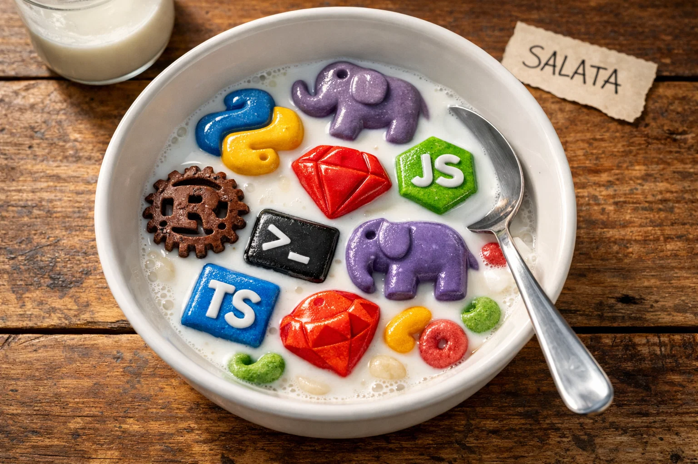

# Salata

**Mix Python, Ruby, JavaScript, TypeScript, PHP, and Shell in a single template file.**

<!-- Badges placeholder -->


[Documentation](https://zlatanomerovic.github.io/salata/) | [Getting Started](https://zlatanomerovic.github.io/salata/getting-started/quick-start.html) | [Examples](https://zlatanomerovic.github.io/salata/examples/cli.html)



---

## What Is Salata?

Salata — "salad" in Bosnian, Croatian, Serbian, and most Slavic languages — is a mix of everything thrown together. It processes `.slt` files containing embedded runtime blocks — `<python>`, `<ruby>`, `<javascript>`, `<typescript>`, `<php>`, `<shell>` — executes each block in its native runtime, captures stdout, and splices the output back into the document. The result goes to stdout. Output can be HTML, JSON, plain text, config files, YAML, CSV, Markdown — whatever your code prints.

What makes Salata unique is that no other tool lets you mix six languages in a single file with cross-runtime data sharing. Write data processing in Python, transform it with Ruby, format output with JavaScript — and pass data between them using `#set`/`#get` macros that handle JSON serialization transparently. Each language does what it's best at.

**This is a concept project.** Salata was vibe-coded from the ground up as an experiment in polyglot templating. It's built for playing around, learning, and exploring what happens when you remove the boundaries between languages. It will never be production software, and that's by design. If you're the kind of developer who thinks "what if I could just use Python here and Ruby there in the same file?" — this is for you.

---

## Quick Example

```html
<!-- report.slt — Three languages working together -->

<!-- Python: compute the data -->
<python>
sales = [
    {"product": "Widget A", "region": "North", "amount": 1200},
    {"product": "Widget A", "region": "South", "amount": 2100},
    {"product": "Widget B", "region": "North", "amount": 850},
    {"product": "Widget B", "region": "South", "amount": 1450},
]

# Store the data for other runtimes to use
#set("sales", sales)
#set("total", sum(item["amount"] for item in sales))
</python>

<!-- Ruby: aggregate and transform -->
<ruby>
sales = #get("sales")

# Group by product, sum amounts
totals = sales.group_by { |s| s["product"] }
              .map { |name, items| { "name" => name, "total" => items.sum { |i| i["amount"] } } }
              .sort_by { |p| -p["total"] }

#set("product_totals", totals)
</ruby>

<!-- JavaScript: format the final output -->
<javascript>
const totals = #get("product_totals");
const grandTotal = #get("total");

println("=== Sales Report ===\n");
totals.forEach((p, i) => {
    const pct = ((p.total / grandTotal) * 100).toFixed(1);
    println(`  ${i + 1}. ${p.name.padEnd(12)} $${p.total.toString().padStart(5)}  (${pct}%)`);
});
println(`\n  Total: $${grandTotal}`);
</javascript>
```

Run it:

```bash
$ salata report.slt
=== Sales Report ===

  1. Widget A     $3300  (58.9%)
  2. Widget B     $2300  (41.1%)

  Total: $5600
```

Three languages, one file, data flowing between them. That's Salata.

---

## Individual Runtime Examples

### Python — Data Processing

```html
<!-- csv-report.slt — Python is great at crunching data -->
<python>
import csv
import io

# Parse CSV data and generate a formatted report
data = """name,department,salary
Alice,Engineering,95000
Bob,Marketing,72000
Charlie,Engineering,105000
Diana,Marketing,68000
Eve,Engineering,110000"""

reader = csv.DictReader(io.StringIO(data))
rows = list(reader)

# Compute department averages
depts = {}
for row in rows:
    dept = row["department"]
    depts.setdefault(dept, []).append(int(row["salary"]))

print("Department Salary Report")
print("=" * 40)
for dept, salaries in sorted(depts.items()):
    avg = sum(salaries) / len(salaries)
    print(f"  {dept:<15} avg: ${avg:>10,.0f}  ({len(salaries)} employees)")
print(f"\n  Company avg:     ${sum(int(r['salary']) for r in rows) / len(rows):>10,.0f}")
</python>
```

### Ruby — Text Formatting

```html
<!-- table.slt — Ruby shines at string manipulation and formatting -->
<ruby>
# Build a nicely formatted Markdown table from structured data
projects = [
  { name: "Alpha",   status: "Complete",    progress: 100 },
  { name: "Beta",    status: "In Progress", progress: 67 },
  { name: "Gamma",   status: "In Progress", progress: 70 },
  { name: "Delta",   status: "Planning",    progress: 0 },
]

puts "| Project | Status      | Progress   |"
puts "|---------|-------------|------------|"
projects.each do |p|
  # Build a visual progress bar
  filled = "#" * (p[:progress] / 10)
  empty  = "." * (10 - p[:progress] / 10)
  puts "| #{p[:name].ljust(7)} | #{p[:status].ljust(11)} | [#{filled}#{empty}] |"
end
</ruby>
```

### JavaScript — JSON Manipulation

```html
<!-- api-response.slt — JavaScript is natural for JSON work -->
#content-type application/json
<javascript>
// Build a structured API response with nested data
const users = [
    { id: 1, name: "Alice", roles: ["admin", "user"], active: true },
    { id: 2, name: "Bob",   roles: ["user"],          active: true },
    { id: 3, name: "Charlie", roles: ["user"],         active: false },
];

const response = {
    status: "ok",
    data: users.filter(u => u.active),
    meta: {
        total: users.length,
        active: users.filter(u => u.active).length,
        generated_at: new Date().toISOString(),
    }
};

// Pretty-print with 2-space indentation
print(JSON.stringify(response, null, 2));
</javascript>
```

### TypeScript — Typed Validation

```html
<!-- validate.slt — TypeScript adds type safety to your templates -->
<typescript>
// Type-safe data processing with compile-time checks
interface Product {
    name: string;
    price: number;
    inStock: boolean;
}

const inventory: Product[] = [
    { name: "Laptop",   price: 999.99,  inStock: true },
    { name: "Mouse",    price: 29.99,   inStock: true },
    { name: "Monitor",  price: 449.99,  inStock: false },
    { name: "Keyboard", price: 79.99,   inStock: true },
];

// TypeScript catches type errors at transpile time
const available: Product[] = inventory.filter(p => p.inStock);
const totalValue: number = available.reduce((sum, p) => sum + p.price, 0);

println(`Available products: ${available.length}/${inventory.length}`);
println(`Total inventory value: $${totalValue.toFixed(2)}`);
available.forEach(p => println(`  - ${p.name}: $${p.price}`));
</typescript>
```

### PHP — Web-Native Features

```html
<!-- page.slt — PHP does what PHP does best -->
<!DOCTYPE html>
<html>
<body>
    <h1>Dashboard</h1>
    <php>
    // PHP's string and date functions are unmatched for quick web work
    $now = date('l, F j, Y \a\t g:i A');
    echo "<p>Generated: <strong>$now</strong></p>";

    // Built-in encoding, hashing, string manipulation
    $token = bin2hex(random_bytes(16));
    echo "<p>Session: <code>" . substr($token, 0, 8) . "...</code></p>";

    $words = str_word_count("Salata is a polyglot templating engine");
    echo "<p>Tagline is $words words long.</p>";
    </php>
</body>
</html>
```

### Shell — System Information

```html
<!-- sysinfo.slt — Shell for quick system queries -->
<shell>
echo "=== System Report ==="
echo ""
echo "Hostname: $(hostname)"
echo "Kernel:   $(uname -sr)"
echo "Arch:     $(uname -m)"
echo "Date:     $(date '+%Y-%m-%d %H:%M:%S')"
echo ""
echo "--- Disk Usage ---"
df -h / | tail -1 | awk '{printf "  Root: %s used of %s (%s)\n", $3, $2, $5}'
echo ""
echo "=== End Report ==="
</shell>
```

---

## Cross-Runtime Data Sharing

This is the killer feature. `#set` and `#get` macros let you pass data between completely different language runtimes. Python doesn't talk to Ruby directly — Salata acts as the broker, serializing values to JSON and deserializing them into native types on the other side.

### How It Works

1. Runtime A calls `#set("key", value)` — Salata serializes the value to JSON and stores it
2. Runtime B calls `#get("key")` — Salata reads the JSON and deserializes it into B's native type
3. Each `#set`/`#get` is expanded into native code before execution — no runtime overhead

### Full Pipeline Example

```html
<!-- pipeline.slt — Data flows: Python → Ruby → JavaScript -->

<!-- Step 1: Python generates raw data -->
<python>
sales = [
    {"product": "Widget A", "region": "North", "amount": 1200},
    {"product": "Widget B", "region": "South", "amount": 850},
    {"product": "Widget A", "region": "South", "amount": 2100},
    {"product": "Widget C", "region": "North", "amount": 675},
    {"product": "Widget B", "region": "North", "amount": 1450},
    {"product": "Widget C", "region": "South", "amount": 920},
]
#set("raw_sales", sales)
</python>

<!-- Step 2: Ruby transforms — aggregate by product -->
<ruby>
sales = #get("raw_sales")

totals = {}
sales.each do |sale|
    name = sale["product"]
    totals[name] ||= 0
    totals[name] += sale["amount"]
end

sorted = totals.sort_by { |_, v| -v }.map { |k, v| {"product" => k, "total" => v} }
#set("product_totals", sorted)
#set("grand_total", totals.values.sum)
</ruby>

<!-- Step 3: JavaScript formats the output -->
<javascript>
const totals = #get("product_totals");
const grandTotal = #get("grand_total");

println("=== Sales Summary ===\n");
totals.forEach((item, i) => {
    const pct = ((item.total / grandTotal) * 100).toFixed(1);
    const bar = "#".repeat(Math.round(pct / 2));
    println(`  ${i + 1}. ${item.product.padEnd(10)} $${item.total.toString().padStart(5)}  ${pct.padStart(5)}%  ${bar}`);
});
println(`\n  Grand Total: $${grandTotal}`);
</javascript>
```

### Supported Types

| Type | Python | Ruby | JavaScript | PHP |
|------|--------|------|------------|-----|
| String | `str` | `String` | `string` | `string` |
| Number | `int`/`float` | `Integer`/`Float` | `number` | `int`/`float` |
| Boolean | `True`/`False` | `true`/`false` | `true`/`false` | `true`/`false` |
| Array | `list` | `Array` | `Array` | `array` |
| Object | `dict` | `Hash` | `Object` | `array` (assoc) |
| Null | `None` | `nil` | `null` | `null` |

All types round-trip transparently through JSON serialization. You `#set` a Python list and `#get` a Ruby Array — it just works.

---

## Playground (Recommended)

**The easiest way to try Salata.** One command gives you a Docker container with Ubuntu, all six runtimes pre-installed, popular editors (nano, vim, neovim, emacs), Starship prompt, `bat` for syntax-highlighted file viewing, and pre-built Salata binaries. No local setup, no runtime hunting, no config files to write.

```bash
# Linux / macOS
./playground/start-playground.sh

# Windows CMD
playground\start-playground.bat

# PowerShell
playground\start-playground.ps1
```

You'll land in an interactive bash session with a welcome banner showing all detected runtimes and a starter project ready to go. Port 3000 is exposed for `salata-server` testing. Files saved in `workspace/` persist between sessions.

If you want to try Salata without thinking about setup, this is the way.

### What You Get

```
  ____    _    _        _  _____  _
 / ___|  / \  | |      / \|_   _|/ \
 \___ \ / _ \ | |     / _ \ | | / _ \
  ___) / ___ \| |___ / ___ \| |/ ___ \
 |____/_/   \_\_____/_/   \_\_/_/   \_\

 salata v0.1.0 — Polyglot Text Templating Engine

 Runtimes:
   Python ...... Python 3.12.x
   Ruby ........ ruby 3.2.x
   Node.js ..... v20.x.x
   TypeScript .. ts-node v10.x, tsx v4.x
   PHP ......... PHP 8.3.x
   Bash ........ GNU bash, version 5.2.x

 Quick start:
   salata index.slt              Process the starter file
   salata init --path mysite     Scaffold a new project
   salata-server . --port 3000   Start dev server (localhost:3000)

 Examples (in ~/examples/):
   examples/cli/hello-world/     One file per runtime
   examples/cli/cross-runtime-pipeline/  #set/#get across runtimes
   examples/web/portfolio/       Multi-page site with #include
   examples/web/dashboard/       4 runtimes on one page
   ... and more — run 'ls examples/cli examples/web' to see all
```

The container also includes:
- Salata source at `/opt/salata` — hack on the engine itself
- `rebuild-salata` command — recompile and install after changes
- 15 example projects in `~/examples/` ready to run
- `bat` for syntax-highlighted `.slt` file viewing

---

## Local Installation

> **Use at your own caution.** The shell runtime executes actual shell commands on your system. Salata includes a sandbox (blocked commands, blocked paths, static analysis, ulimits), but this is experimental software. The [Playground](#playground-recommended) runs everything in a disposable Docker container and is the safer option.

### Build from Source

```bash
# Clone the repository
git clone https://github.com/ZlatanOmerovic/salata.git
cd salata

# Build all four binaries
cargo build --release

# Binaries are in target/release/
# Copy them somewhere in your PATH:
cp target/release/salata         /usr/local/bin/
cp target/release/salata-cgi     /usr/local/bin/
cp target/release/salata-server  /usr/local/bin/
```

### Bootstrap a Project

`salata init` detects which runtimes are installed on your system and generates a config automatically:

```bash
$ salata init --path my-project

Detecting runtimes...
  python3   /usr/bin/python3        found
  ruby      /usr/bin/ruby           found
  node      /usr/bin/node           found
  tsx       /usr/local/bin/tsx      found
  php       /usr/bin/php            found
  php-cgi   /usr/bin/php-cgi       found
  bash      /bin/bash               found

Created my-project/config.toml with 6 of 6 runtimes enabled.
Created my-project/index.slt
Created my-project/errors/404.slt
Created my-project/errors/500.slt
```

### Runtime Discovery Scripts

For manual config generation without the Rust binary:

```bash
./scripts/detect-runtimes.sh        # Linux / macOS
scripts\detect-runtimes.bat         # Windows CMD
scripts\detect-runtimes.ps1         # PowerShell
```

### Cross-Platform

Salata builds and runs on macOS, Linux, and Windows (x64, x86, ARM). No platform-specific code — uses `std::path::PathBuf`, handles line endings, and spawns processes portably.

---

## Usage

### CLI — Core Interpreter

```bash
# Basic — process a file and print to stdout
salata index.slt

# Redirect to a file
salata index.slt > output.html

# Non-HTML output — salata doesn't care what your code prints
salata template.slt > nginx.conf
salata report.slt > report.csv
salata data.slt > output.yaml

# Custom config location
salata --config /etc/salata/config.toml index.slt

# Bootstrap a new project
salata init
salata init --path ./my-site
```

### Development Server

```bash
# Serve a directory — .slt files processed, static files served as-is
salata-server ./my-site --port 3000

# Single file mode
salata-server index.slt --port 3000
```

The server watches for file changes when `hot_reload = true` (default) and automatically reparses modified `.slt` files.

### CGI Bridge

`salata-cgi` handles HTTP request/response formatting and includes built-in security protections (Slowloris defense, path traversal blocking, input sanitization, and more). The binary is fully built, but integration with nginx and Apache has not been tested yet. Testing and configuration documentation for nginx/Apache are coming.

For now, use `salata-server` to serve `.slt` files over HTTP.

---

## Supported Runtimes

| Language | Tag | Output Method | Notes |
|----------|-----|---------------|-------|
| Python | `<python>` | `print()` | Data processing, computation, CSV/JSON handling |
| Ruby | `<ruby>` | `puts` | Text formatting, string manipulation, DSLs |
| JavaScript | `<javascript>` | `console.log()`, `print()`, `println()` | JSON, DOM-like string building, async-free |
| TypeScript | `<typescript>` | `console.log()`, `print()`, `println()` | Type-safe templates, interfaces, validation |
| PHP | `<php>` | `echo` | Date formatting, string functions, web-native features |
| Shell | `<shell>` | `echo` | System info, file operations, environment queries |

`print()` and `println()` are injected helpers for JS/TS — additive, nothing overridden. `console.log` and `process.stdout.write` still work normally.

---

## Architecture

Salata is built as a Cargo workspace with four binaries sharing a common library:

```
salata-core       <-- shared library (config, parser, runtimes, security)
salata-cli        <-- depends on salata-core
salata-cgi        <-- depends on salata-core
salata-fastcgi    <-- depends on salata-core (stub)
salata-server     <-- depends on salata-cgi --> salata-core
```

| Binary | Purpose |
|--------|---------|
| `salata` | Core interpreter. File in, text out. No HTTP, no networking. |
| `salata-cgi` | CGI bridge with built-in attack protections. Built but not yet tested with nginx/Apache. |
| `salata-fastcgi` | FastCGI daemon. Stub for now — prints "not yet implemented". |
| `salata-server` | Standalone dev server. The only tested way to serve `.slt` files over HTTP right now. |

### Execution Context

Each binary sets an execution context that affects runtime behavior — most notably PHP binary selection:

| Binary | Context | PHP Binary |
|--------|---------|------------|
| `salata` | CLI | `php` (direct) |
| `salata-cgi` | CGI | `php-cgi` |
| `salata-fastcgi` | FastCGI | `php-fpm` (socket/TCP) |
| `salata-server` | Server | `php-fpm` (socket/TCP) |

This mirrors PHP's own SAPI model — the same `.slt` file works correctly regardless of which binary runs it.

### Processing Pipeline

```
Read .slt file
  --> Resolve #include directives (text substitution, max depth 16)
  --> Extract #status, #content-type, #header, #cookie, #redirect
  --> Parse content, extract runtime blocks
  --> Validate: no nested runtime tags
  --> Check runtime enabled status
  --> Expand #set/#get macros into native code
  --> For each language: spawn/reuse process (shared scope)
  --> Send code with boundary markers, capture stdout per block
  --> Splice outputs back into document positions
  --> Write final output to stdout
```

Full details: [specs/ARCHITECTURE.md](specs/ARCHITECTURE.md)

---

## Key Features

### Directives

Pre-execution instructions that appear in the document (outside runtime blocks):

```html
#include "header.slt"                 <!-- Text substitution, max 16 levels deep -->
#status 404                           <!-- HTTP status code (once per page) -->
#content-type application/json        <!-- Response MIME type (once per page) -->
#header "X-Powered-By" "Salata"       <!-- Custom response header (multiple OK) -->
#cookie "session" "abc123" httponly    <!-- Set a cookie (multiple OK) -->
#redirect "/other-page"               <!-- HTTP redirect -->
```

### Shared vs Isolated Scope

By default, all blocks of the same language share a single process — variables persist:

```html
<python>
x = 42
print(f"Block 1: x = {x}")
</python>

<p>Some HTML between blocks</p>

<python>
# x is still 42 — same Python process
print(f"Block 2: x = {x}")
x += 1
</python>
```

Use `scope="isolated"` for a fresh process per block:

```html
<python scope="isolated">
x = 42
print(f"Block 1: x = {x}")
</python>

<python scope="isolated">
# x is NOT defined — new Python process
try:
    print(x)
except NameError:
    print("x doesn't exist here")
</python>
```

### Shell Sandbox

Shell is the most restricted runtime. Three phases of protection, all built into the binary (no external tools):

1. **Pre-execution static analysis** — scans for 70+ blocked commands (`rm`, `sudo`, `chmod`, `kill`, `ssh`, etc.), blocked patterns (backgrounding, pipe to shell, `eval`, fork bombs), and blocked paths (`/dev`, `/proc`, `/sys`, `/etc`)
2. **Environment setup** — clean PATH, stripped env vars, locked working directory, ulimit enforcement
3. **Runtime monitoring** — timeout kills, memory tracking, output size limits

### CGI Security

`salata-cgi` includes protections against common attack vectors:
- **Slowloris** — header/body timeouts, minimum data rate
- **Request limits** — URL length, header size/count, body size
- **Process limits** — per-IP connections, execution time, memory, response size
- **Path security** — traversal blocking, dotfile blocking, extension filtering
- **Input sanitization** — null byte blocking, non-printable header detection, content-length validation

### PHP Context-Aware Binary

PHP binary selection follows PHP's own SAPI model:

```toml
[runtimes.php]
cli_path = "/usr/bin/php"           # Used by: salata (CLI)
cgi_path = "/usr/bin/php-cgi"       # Used by: salata-cgi
fastcgi_socket = "/run/php/php-fpm.sock"  # Used by: salata-server, salata-fastcgi
```

### Not HTML-Specific

Salata outputs whatever your code prints. Some examples from the `examples/` directory:

```bash
salata report.slt > report.md        # Markdown
salata template.slt > nginx.conf     # Config files
salata data.slt > export.csv         # CSV
salata inventory.slt > data.yaml     # YAML
salata api.slt                       # JSON (with #content-type application/json)
```

### Other Features

- **Runtime enable/disable** — toggle runtimes in config; disabled runtimes produce clear errors
- **Hot reload** — dev server watches for file changes
- **Custom error pages** — 404/500 pages can be `.slt` files with dynamic content
- **`salata init`** — detects runtimes, generates config.toml and starter files
- **Per-runtime logging** — separate log files with rotation
- **Parsed file caching** — by file path + mtime

---

## Configuration

Salata requires a `config.toml`. Lookup order: `--config` flag, then `config.toml` next to the binary, then error.

### Minimal Config

```toml
[salata]
display_errors = true
default_content_type = "text/html; charset=utf-8"
encoding = "utf-8"

[logging]
directory = "./logs"

# Enable only what you need
[runtimes.python]
enabled = true
path = "/usr/bin/python3"
shared_scope = true

[runtimes.ruby]
enabled = true
path = "/usr/bin/ruby"
shared_scope = true

[runtimes.javascript]
enabled = true
path = "/usr/bin/node"
shared_scope = true

# Disable runtimes you don't use
[runtimes.typescript]
enabled = false
path = "/usr/local/bin/tsx"

[runtimes.php]
enabled = false
cli_path = "/usr/bin/php"
cgi_path = "/usr/bin/php-cgi"

[runtimes.shell]
enabled = true
path = "/bin/bash"
shared_scope = true
```

Full reference with all CGI protection settings, logging configuration, and error page options: [specs/CONFIGURATION.md](specs/CONFIGURATION.md)

---

## Examples

The `examples/` directory contains 15 self-contained examples, each with its own `config.toml` and `README.md`.

### CLI Examples

| Example | Description |
|---------|-------------|
| [hello-world](examples/cli/hello-world/) | One `.slt` per runtime — simplest possible examples |
| [data-processing](examples/cli/data-processing/) | Python CSV tables, Ruby JSON filtering, Shell system reports |
| [config-generator](examples/cli/config-generator/) | Generate a valid nginx.conf with Python + Shell |
| [markdown-report](examples/cli/markdown-report/) | Project status report as pure Markdown |
| [cross-runtime-pipeline](examples/cli/cross-runtime-pipeline/) | Data flows Python -> Ruby -> JavaScript via `#set/#get` |
| [scope-demo](examples/cli/scope-demo/) | Shared vs isolated scope side-by-side |
| [json-api-mock](examples/cli/json-api-mock/) | JSON API response with `#content-type` |
| [multi-format](examples/cli/multi-format/) | Same data output as text, CSV, and YAML |

### Web Examples

| Example | Description |
|---------|-------------|
| [single-file](examples/web/single-file/) | One file per directive: `#status`, `#redirect`, `#header`, `#cookie` |
| [portfolio](examples/web/portfolio/) | Multi-page site with `#include`, shared partials, static CSS |
| [dashboard](examples/web/dashboard/) | Four runtimes + `#set/#get` + inline SVG on one page |
| [php-showcase](examples/web/php-showcase/) | PHP and Python side-by-side |
| [api-endpoint](examples/web/api-endpoint/) | JSON API with `#content-type` and `#status` |
| [error-pages](examples/web/error-pages/) | Custom 404/500 `.slt` templates with dynamic content |
| [blog](examples/web/blog/) | Mini blog: Python reads post files, Ruby formats HTML |

```bash
# Try a CLI example
cd examples/cli/cross-runtime-pipeline
salata --config config.toml pipeline.slt

# Try a web example
cd examples/web/portfolio
salata-server --config config.toml . --port 3000
# Open http://localhost:3000/index.slt
```

---

## Documentation

| Document | Description |
|----------|-------------|
| [Architecture](specs/ARCHITECTURE.md) | Components, execution model, scope management, logging |
| [Configuration](specs/CONFIGURATION.md) | Full config.toml reference with all settings |
| [Runtimes](specs/RUNTIMES.md) | Runtime details, PHP SAPI model, JS/TS helpers, shell whitelist |
| [Directives & Macros](specs/DIRECTIVES_AND_MACROS.md) | `#include`, `#status`, `#set/#get`, all directives |
| [Security](specs/SECURITY.md) | Shell sandbox phases, CGI protections, blocked commands |
| [Testing](specs/TESTING.md) | Unit tests, integration tests, Docker E2E |
| [Playground](specs/PLAYGROUND.md) | Docker playground specification |
| [Examples](specs/EXAMPLES.md) | Examples directory guide |
| [Project Structure](specs/PROJECT_STRUCTURE.md) | Cargo workspace layout |
| [Uniform AST](specs/UNIFORM_AST.md) | Future vision: cross-language transpilation |

---

## Testing

```bash
# Unit + integration tests (462 tests)
cargo test

# Clippy — zero warnings policy
cargo clippy --all-targets

# E2E tests (requires Docker — runs all runtimes in container)
docker compose -f docker/docker-compose.yml up --build test
```

Tests cover: parser, directives, macro expansion, config validation, shell sandbox (every blocked command, fork bombs, backgrounding, pipe-to-shell, path access), CGI protections (Slowloris, path traversal, null bytes, size limits), runtime execution (shared/isolated scope, boundary markers), PHP context-aware binary selection, error handling, and `salata init` project scaffolding.

---

## Project Status

**This is a concept project.** It was vibe-coded with [Claude Code](https://claude.com/claude-code) (Anthropic's AI coding tool) as an experiment in polyglot templating. The entire thing — parser, runtimes, sandbox, server, playground, examples — was built through conversational programming.

Salata is not production-ready and never will be. That's the point. It exists to explore an idea: *what if you could use any language anywhere in a single file?* Turns out, you can. And it's pretty fun.

**What works:**
- All 6 runtimes execute correctly with shared and isolated scope
- Cross-runtime data sharing via `#set/#get`
- All directives (`#include`, `#status`, `#redirect`, `#header`, `#cookie`, `#content-type`)
- Shell sandbox with 70+ blocked commands and 3-phase protection
- Dev server (`salata-server`) with static file serving and hot reload — the only tested way to serve `.slt` over HTTP
- CGI bridge (`salata-cgi`) binary with full attack protection suite (built, not yet tested with nginx/Apache)
- `salata init` project bootstrapping with runtime detection
- 462 passing tests

**What's planned:**
- nginx integration via `salata-cgi` (testing and documentation coming)
- Apache integration via `salata-cgi` (testing and documentation coming)
- FastCGI daemon (`salata-fastcgi` / `salata-fpm`) for persistent connections with nginx and Apache
- Uniform AST — cross-language class/function transpilation with TypeScript as source of truth
- Shell `#set/#get` macro syntax fix

**What will never happen:**
- Production deployment recommendations
- SLA or stability guarantees
- Corporate support

---

## Contributing

Contributions, ideas, and forks are welcome. This is a playground for polyglot ideas — if you think of something interesting, open a PR or an issue.

**Repository:** [github.com/ZlatanOmerovic/salata](https://github.com/ZlatanOmerovic/salata)

Built by [@ZlatanOmerovic](https://github.com/ZlatanOmerovic). PRs, issues, and stars appreciated.

---

## License

MIT License. Free to use, modify, and distribute. Credit appreciated.

---

## Acknowledgments

- Built with [Rust](https://www.rust-lang.org/) and the Cargo ecosystem
- Vibe-coded with [Claude Code](https://claude.com/claude-code) by [Anthropic](https://www.anthropic.com/)
- Dev server powered by [actix-web](https://actix.rs/)
- Playground shell prompt by [Starship](https://starship.rs/)
- Syntax highlighting by [bat](https://github.com/sharkdp/bat)
